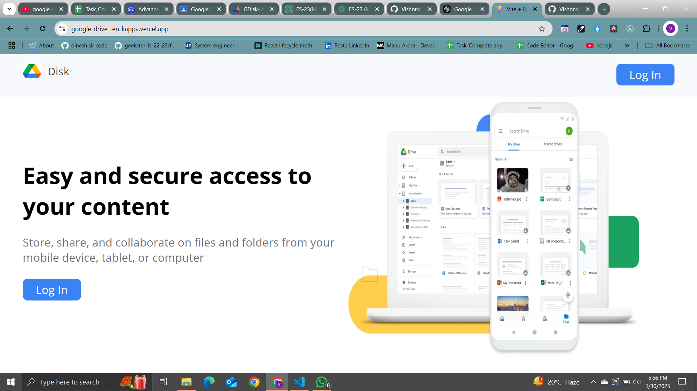
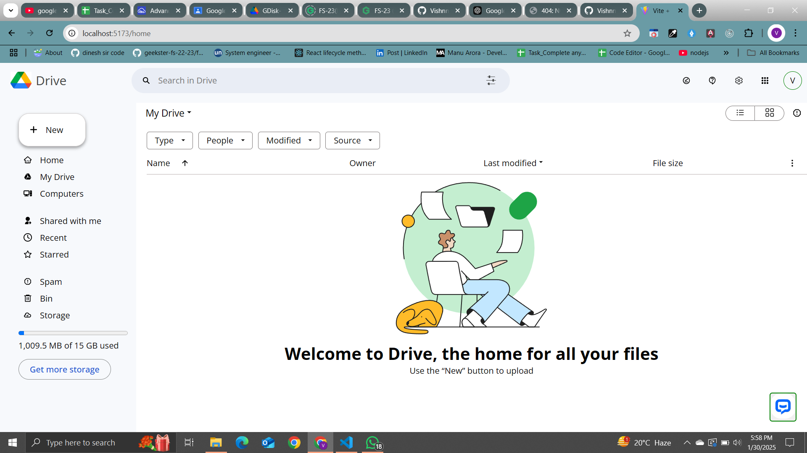
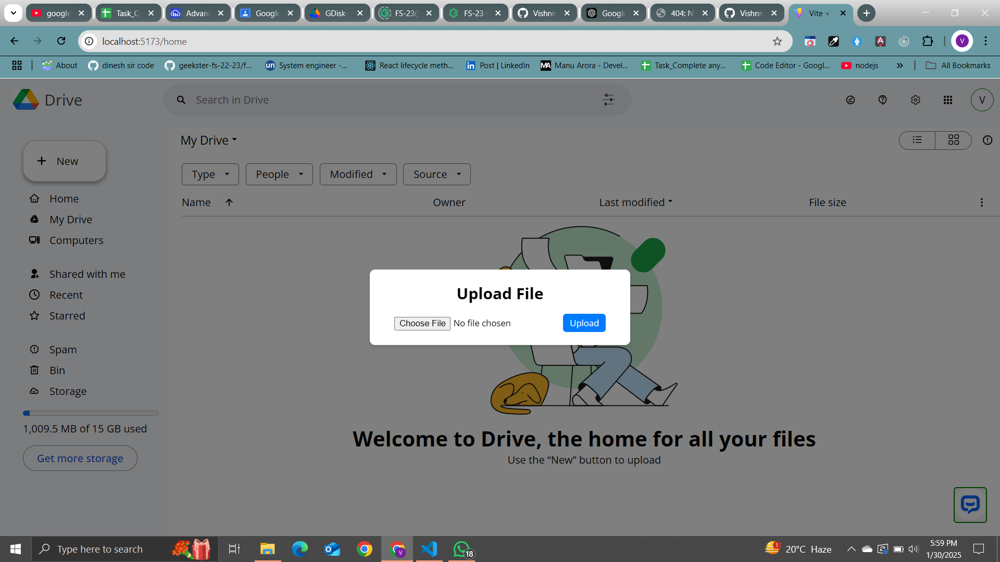
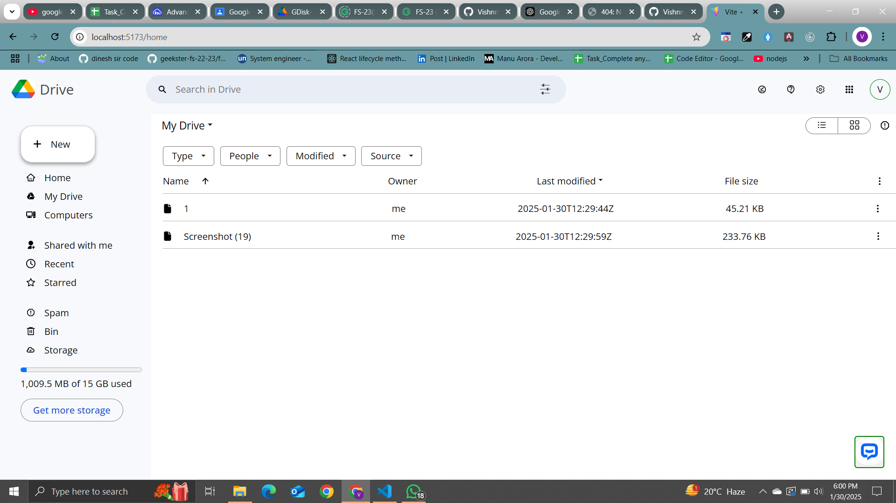
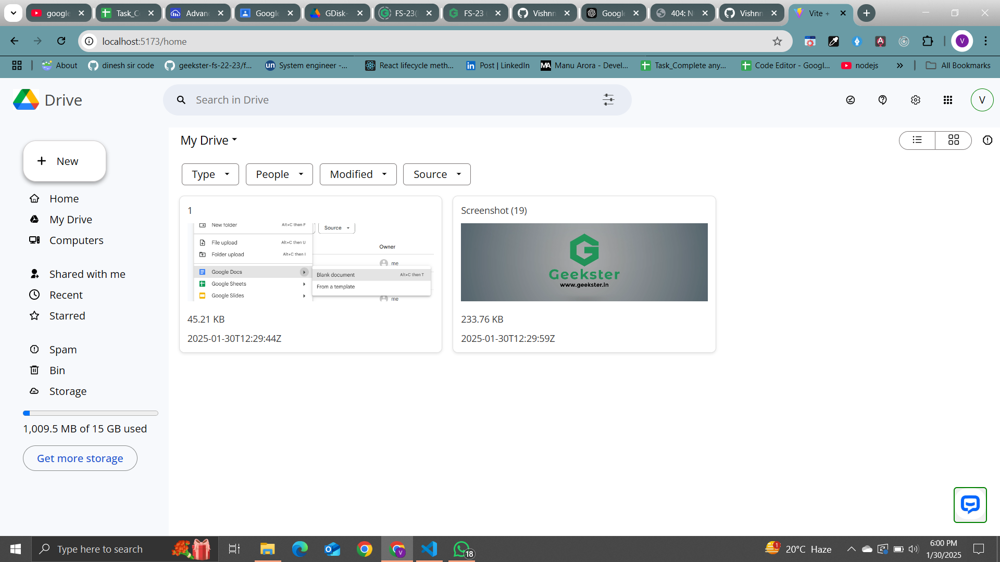
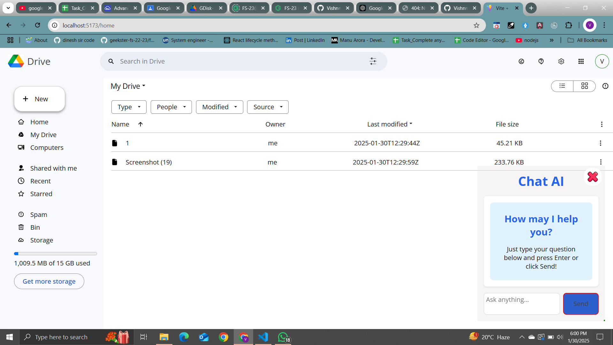

# Digital Storage Hub
This is a Digital Storage Hub application built with React, featuring Google Authentication using Firebase, cloud storage integration with Cloudinary, drag-and-drop functionality, and an AI chat feature. The app allows users to upload, store, and manage their files with ease.
## Features
- Google Authentication using Firebase
- Cloud Storage with Cloudinary API
- Drag and Drop functionality for file uploads
- AI Chat feature
- Responsive UI using Material UI

## Tech Stack
- React & Vite
- Firebase (for Authentication)
- Cloudinary API (for cloud storage)
- Material-UI (for UI components)

## Installation

1. Clone the repository:
    ```bash
    git clone https://github.com/Vishnnsingh/Google-Drive.git
    cd google-drive-clone
    ```

2. Install dependencies:
    ```bash
    npm install
    ```

3. Set up Firebase Authentication and Cloudinary:
    - Follow instructions on Firebase and Cloudinary to get your credentials and add them to `.env` file.
    - Enable Google Authentication on Firebase.
    - Set up Cloudinary API keys.

4. Start the development server:
    ```bash
    npm run dev
    ```

5. Visit the app at [http://localhost:3000](http://localhost:3000).

## Usage

- Log in with your Google account to access the app.
- Upload files by dragging them into the designated area.
- Use the AI chat feature to interact with the chatbot.
- Manage your files directly in the interface.

## Photos and Links










[Visit the live app](https://google-drive-ten-kappa.vercel.app/)

### Adding Photos:
1. Upload images to Cloudinary.
2. Add the image URLs to your app wherever you need them.

For example:
```html


### 7. **License**
Finally, if you’re using a license for your project, add it at the bottom of the README:

```markdown
## License

This project is licensed under the Vishnu singh.
